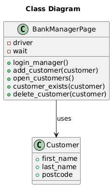

# Quality Engineer Assessment by Robert Connolly

This repository contains my solution for the Quality Engineer technical assessment.

---

## Environment Setup

Create a virtual environment:
```bash
python -m venv venv
```

Activate the virtual environment (Windows):
```bash
venv\Scripts\activate
```

Install dependencies:
```bash
pip install -r requirements.txt
```
---

## Running the Tests

Tests are executed using a BDD test runner.

Run all tests with:
```bash
behave tests/features
```

---

## Theory Questions

### MCQ Q1-Q6
1. **What is "bug severity"?** The Degree of impact a defect has on the system.

2. **Which statement is essential to communicate successfully and maintain constructive relations with developers when there is a conflict over the prioritisation of a defect?** Remind them of the common goal of creating quality systems.

3. **What is the typical objective of a unit test?** To validate that each unit of the software performs as designed.

4. **An update to the legacy system has been approved and the developers plan to use third party software to provide the new functionality. The third party software has already been tested but the interface between the existing software and the new software is problematic. Your existing test automation needs to be extended to test the interface between these two products. How should you approach implementing the best automation solution?** Investigate if automation is possible via the APIs used to interface with the third party software.

5. **You are including new features in your team's current automated solution. Which steps would you take to ensure there is no adverse effect in the existing functionalities?** Compare the new and old automated solution versions and assess the impact of any differences.

6. **Which tools you use for API Testing?** Postman.

---

### Question 7 - Defining Test Scenarios
Let's imagine you are assigned to test the Facebook application. Your goal is to test a 'publishing a status update' feature.

* How would you define your
    - Test scenario(s)
    - Acceptance criteria

**Please present the answer in a simple, clear and concise format.**

In this case, for a status update feature, I would think about all possible edge cases and how the user might act, including situations where the user **might try to break the validation** or the input field. Based on this, a few test scenarios and acceptance criteria I would assert include:

**Test Scenarios**

- User publishes an empty status.
- User submits a status below the minimum length.
- User submits a status exceeding the maximum number of characters.
- User submits a status containing only empty spaces (one or more).
- User publishes a status with special characters or emojis.
- User publishes multiple status updates within a short period of time.

**Acceptance Criteria**

- Empty or whitespace status submissions are rejected and a validation message is shown.
- Minimum and maximum length validations return rejected validation messages.
- Special characters and emojis are handled correctly.
- Multiple submissions in a short time are handled correctly, for example by using a timeout.
- Validation is enforced using rules with regex for example.

---

### Question 8 - Defining Test Data 
In the problem above, 
1. **How would you define test data against which you could run your scenarios?**
    - In question 7, I described different scenarios a user could face when trying to update their status in the Facebook web application. The test data in this case would mainly be invalid messages, such as values below the minimum or above the maximum character limit, an empty field, whitespace-only input, or a field containing special characters or emojis.
2. **What are the dependencies?**
    - I am not fully sure if this refers to actual libraries, but for automation we would need Selenium for browser interaction, in my case using Python. Network connectivity would also be required for posting updates, and access to an API would be useful for retrieving status updates. A threading library could also be useful to support concurrent test execution and reduce execution time.
3. **How would you manage the test data so if required your tests could be run offline?**
    - For offline execution, I would create a mock API. In my case, I would use the mock module from Python’s unittest library to allow tests to run without any real network connection or database interaction. Another option would be to save data locally from the last online execution and reuse it.
4. **How about running the test online (e.g. against live web site)? What's your approach?**
    - For online execution, it is important not to use production servers. Tests should run against test environments and databases, using fake users created specifically for testing purposes.

---

## Practical

Using your preferred automation framework, Selenium or
Cypress or Playwright and your preferred programming language (Python or Java Script or Type Script etc.) create some executable cucumber feature
spec(s)

Start in the Home Page https://www.globalsqa.com/angularJs-protractor/BankingProject/#/login
1. Choose “**Bank Manager Login**”.
2. Choose “**Add Customer**”.
3. Fill the form for
    - First Name
    - Last Name
    - Post Code
    - Click “**Add Customer**”.
4. Go to “**Customers**” Tab
5. **Validate** that the new customer has been added successfully
6. **Delete** the newly added customer
7. **Validate** that the customer has been successfully deleted

### My Solution

The solution uses a simple Page Object Model approach to separate test intent from implementation details.
The BankManagerPage class encapsulates all Selenium interactions related to the Bank Manager workflow, while a Customer model is used to represent test data passed between steps.
Step definitions focus on behaviour and readability, delegating UI interactions to the page object to keep the scenarios clear and maintainable.

The class diagram below illustrates the main components of the solution and their relationships.



---
